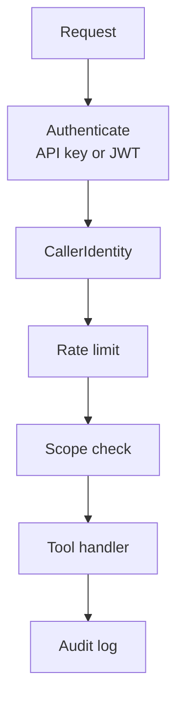

# Concepts

Every request flows through the same path. Understanding it is most of understanding `pontifex-mcp`.

## Authentication

Two credential types resolve to **one identity**:

-   __API keys__

    Tokens prefixed `sk_…`, for scripts, CI, and machine-to-machine callers. Hashed at rest; looked up
    by the resolver.

-   __OAuth 2.1 JWTs__

    For interactive clients (Claude Desktop, agents). Validated against your OIDC provider's JWKS — any
    provider works (Auth0, Entra, Clerk, Keycloak).

Both produce a **`CallerIdentity`** — a stable `owner_id`, the granted `scopes`, and a `rate_limit_rpm`.
Downstream code never has to know which credential type was used.

!!! note

    JWT validation is asymmetric-only and rejects `alg: none`. A caller can't raise their own rate limit
    or scopes with a forged claim — limits come from server configuration, not the token.

## Scopes

Permissions use the format **`domain:resource:action`** (e.g. `orders:order:read`). The scope required
by a tool is declared on its `tool_runtime` decorator and checked **before the handler runs**.

| Scope | Grants |
| --- | --- |
| `orders:order:read` | one tool |
| `orders:*:read` | read across the whole domain |
| `orders:*:*` | full access to the domain |

A caller is granted scopes by their API key or their JWT claims — and can never widen them at runtime.

## The tool runtime

`tool_runtime` is the decorator that wraps each handler. Around your code it:

1.  **Checks the scope** — denies with a structured error if the caller lacks `domain:resource:action`.
2.  **Runs your handler** — you return plain data; `InvalidInput` is the one exception you raise for
    bad arguments.
3.  **Writes the audit row** — who called, what, when, which data source, cache hit, and latency.
4.  **Normalizes errors** — your return value passes through unchanged on success; a raised error
    becomes a structured `ToolError`, with no stack traces leaking to the caller.

## Data adapters

External calls go through the **`DataAdapter`** protocol rather than being made directly in a tool. A
**`DataSourceManager`** orders adapters by health and tracks their success/failure, so your tool can
iterate the available sources and **fail over** when one is down.

!!! tip

    Keeping I/O behind adapters is what makes tools testable and resilient — and it's where `Cache`,
    `async_retry`, and `CircuitBreaker` plug in.

## Audit

Every tool call produces an **`AuditRecord`**, written by an **`AuditWriter`**. Use `DbAuditWriter` to
persist to Postgres (the production default) or `NoopAuditWriter` in tests. This is the trail you need
for compliance and incident response — answering *who touched what, and when*.
