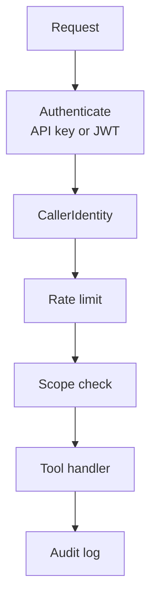
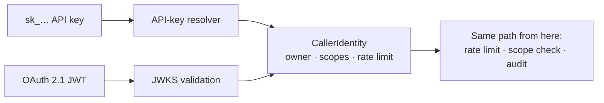
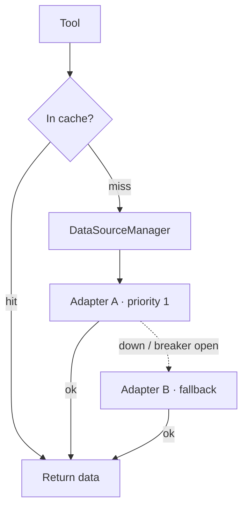

# How a request flows

Every call an agent makes travels the same **request path**. Each guarantee Pontifex
offers, authentication, least privilege, and audit, is a stage on that path. Follow the
path and you understand the product.

Nothing reaches your code until the call has a verified identity, that identity sits
within its rate limit, and its scopes permit the tool. Nothing leaves without a row in
the audit log.

## Authentication

Two credential types resolve to **one identity.**

-   __API keys__

    Tokens prefixed `sk_…`, for scripts, CI, and machine-to-machine callers. Pontifex
    hashes them at rest and never stores the plaintext.

-   __OAuth 2.1 JWTs__

    For interactive clients (Claude Desktop, agents). Pontifex validates them against
    your provider's JWKS. Any OIDC provider works: Auth0, Entra, Clerk, Keycloak.

Both produce a **`CallerIdentity`**: a stable `owner_id`, the granted `scopes`, and a
`rate_limit_rpm`.

Downstream code never knows which credential the caller used. The scope check, the
audit, and the rate limit run the same way either way. To wire each path, see
[Authenticate callers](../guides/authenticate-callers.md).

!!! note

    JWT validation is asymmetric-only and rejects `alg: none`. A caller can't forge a
    claim to raise their rate limit or widen their scopes. Those come from server
    config, not the token.

## Scopes

Permissions take the form **`domain:resource:action`**. For example,
`orders:order:read`.

A tool declares the scope it requires. The runtime checks it **before the handler
runs.**

| Scope | Grants |
| --- | --- |
| `orders:order:read` | one tool |
| `orders:*:read` | read across the whole domain |
| `orders:*:*` | full access to the domain |

Wildcards let you grant breadth on purpose, not by accident. A caller gets scopes from
their API key or their JWT claims and can never expand them at runtime. For the full
match rules, see [Errors & scopes](../reference/errors-and-scopes.md#scopes).

## The tool runtime

`tool_runtime` is the decorator that wraps each handler. It applies the guarantees
around your code, doing four things:

1.  **Checks the scope.** No `domain:resource:action`? The call is denied with a
    structured error.
2.  **Runs your handler.** You return plain data. The one exception you raise is
    `InvalidInput`, for bad arguments.
3.  **Writes the audit row.** Who called, what, when, which data source, cache hit,
    latency.
4.  **Normalizes errors.** Success passes through unchanged. A raised error becomes a
    structured `ToolError`, and no stack traces leak to the caller.

Your handler stays small and domain-focused. The cross-cutting concerns live in the
decorator, applied the same way to every tool.

## Data adapters

A tool never makes external calls itself. It goes through the **`DataAdapter`**
protocol.

A **`DataSourceManager`** orders adapters by health and tracks their success and
failure, so a tool can walk the available sources and **fail over** when one is down.

!!! tip

    Keeping I/O behind adapters makes tools testable and resilient. Adapters are also
    where `Cache`, `async_retry`, and `CircuitBreaker` plug in. Pontifex contains one
    flaky upstream rather than handing it to the caller. To build one, see
    [Resilient adapters](../guides/resilient-adapters.md).

## Connectors

Already have an OpenAPI spec? A [connector](../learn/connect-an-api.md) generates the
tools for you.

Each generated tool is still wrapped in `tool_runtime`, with a derived scope, still
calling through a `DataAdapter`. The request path stays the same. Only the authoring
changes. That is how you onboard a system with config instead of code.

## Audit

Every tool call produces an **`AuditRecord`**, written by an **`AuditWriter`**.

- `DbAuditWriter` persists to Postgres. The production default.
- `NoopAuditWriter` discards. For tests.

This trail gives you the durable answer for compliance and incident response: *who
touched what, and when.* The writer is a protocol, so you can route audit events to
your own sink too.
