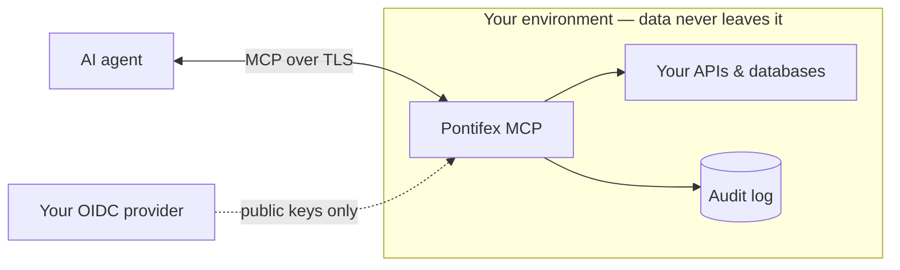

# Security model

Pontifex exists to make one thing safe: **letting an AI agent call your real
systems.**

If you sign off on that, or explain it to a risk committee, this page lays out the
security model in the terms that decision turns on. Engineers build against the same
contract.

## The short version

- **Nothing runs unauthenticated.** Every call carries a verified identity before any
  handler executes.
- **Least privilege.** A caller invokes only the tools their scopes allow. They cannot
  widen their own access.
- **Everything is recorded.** Each call writes an audit row: who, what, when, which
  data source.
- **Your data stays yours.** Self-hosted, on your infrastructure, against your
  databases. No third party in the request path.

Those four properties turn "an agent can reach production" from a liability into a
control you can stand behind.

## Authentication

Two credential types resolve to a single verified identity.

| Credential | For | How it's verified |
| --- | --- | --- |
| `sk_…` **API key** | scripts, CI, machine-to-machine | Hashed at rest. The presented key is hashed and compared; the plaintext is never stored. |
| **OAuth 2.1 JWT** | interactive clients (Claude Desktop, agents) | Signature verified against your provider's JWKS, with issuer and audience checks. |

JWT validation is strict:

- **Asymmetric algorithms only.** Pontifex rejects symmetric and `alg: none` tokens,
  which defeats the classic algorithm-confusion and unsigned-token attacks.
- **No privilege from claims you don't control.** Rate limits and scopes come from
  *server* config and your provider's verified claims. Pontifex ignores a forged
  `rate_limit` or scope claim in a token.
- **No validation oracle.** Rejections return one generic message, so a probing client
  cannot learn *why* a token failed.

## Authorization

Permissions use a `domain:resource:action` scope model, for example `orders:order:read`.

The scope a tool requires is declared on the tool and checked **before the handler
runs.** Scopes come from the caller's API key or their verified token claims, and the
runtime never expands them at runtime. Wildcards (`orders:*:read`) let you grant
breadth on purpose.

This makes **access provable.** For any caller, you can state which tools they can
reach, and Pontifex enforces that set. A caller reaches nothing implicitly, and holds
no ambient authority.

## Audit & accountability

Every call writes an `AuditRecord` to your Postgres database: caller, tool, timestamp,
data source, cache hit, latency.

This trail gives you what you need for **incident response** ("who accessed this, and
when?") and **compliance** evidence. The writer is pluggable, so you can route audit
events to your own sink as well.

## Data residency & isolation

- **Self-hosted.** A library you run on your own infrastructure. No third party in the
  request path. Your data never transits anything outside your environment.
- **You hold the secrets.** Database, Redis, and provider credentials come from
  environment variables. Nothing hardcoded. Nothing phoned home.
- **Standards-based discovery.** OAuth bootstrapping uses RFC 9728 metadata and a
  `WWW-Authenticate` challenge. No proprietary handshake. Nothing to trust beyond your
  own provider.

## Where the line is

Pontifex secures the *MCP layer.* You own the perimeter around it. The split falls
here:

| Pontifex handles | You handle |
| --- | --- |
| Authenticating every call | Running it over TLS, behind your gateway |
| Enforcing `domain:resource:action` scopes | Configuring your OIDC provider |
| Recording every call to the audit log | Securing and rotating your credentials |
| Normalizing errors so nothing leaks | Scoping each API key to the minimum |

The layer does what it claims, and nothing more.
