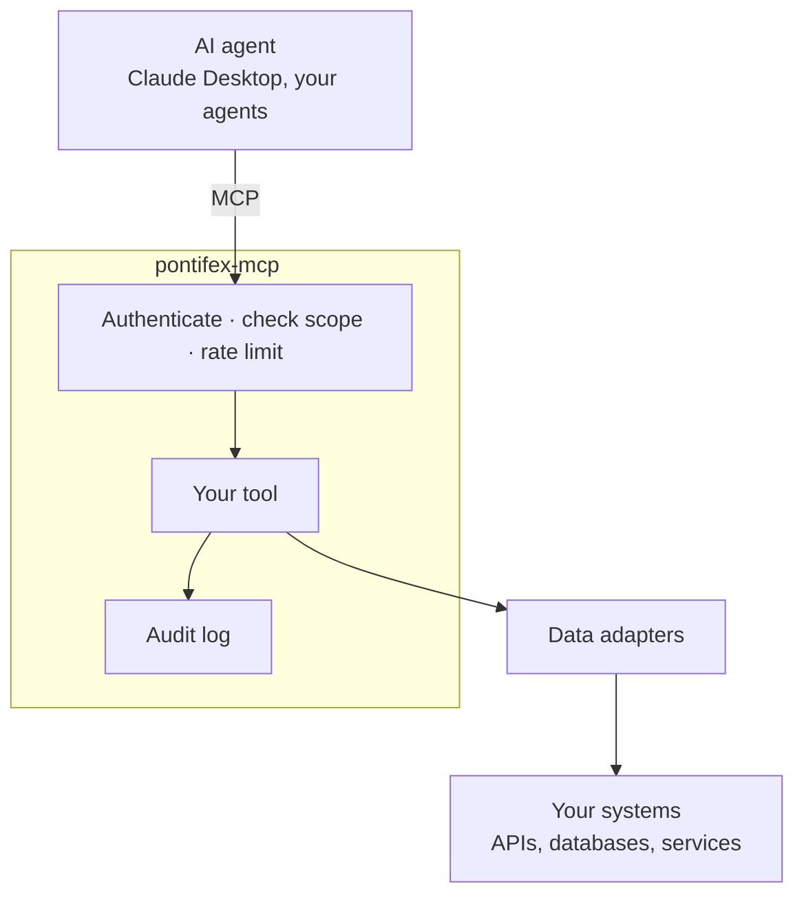

# Pontifex MCP

Enterprise-grade capabilities for MCP servers, built on the official
[MCP Python SDK](https://github.com/modelcontextprotocol/python-sdk).

## The problem

AI agents are ready to do real work — answer questions from your data, take actions in your systems.
[MCP](https://modelcontextprotocol.io) (the **Model Context Protocol**, the open standard agents like
Claude use to call tools) gives you a *server* that exposes those tools. What it doesn't give you is the
control that makes a server safe to point at real data: *who* is calling, *what* they're allowed to
touch, *how often*, and a *record* of what happened.

So teams stall in the same place: the AI works in a demo, but nobody will connect it to the orders
database, the customer records, or the internal APIs — because there's no authentication, no access
control, and no audit trail.

## What Pontifex MCP does

Pontifex MCP is the **connecting layer** between AI agents and the systems your business runs on — it
turns your existing APIs, data stores, and internal services into **governed tools any AI agent can
call**. That's how you get an AI initiative out of pilot and into the parts of the business that matter,
without handing your data to a third party.

*Governed* is the heart of it — and it's a **growing** set of capabilities, not a fixed list. Today the
layer gives every tool call authentication, per-caller scopes, rate limits, observability, and a full
audit trail. More is on the way: this is `0.x`, early, and building in public.

It builds **on** the official MCP Python SDK and stays on **open protocols throughout** — so you run it
on the infrastructure you already use, pair it with any AI vendor, and can strip it out whenever you
like. Your data never leaves your environment.

## What it does today

The capabilities below are live now — the foundation the rest is built on.

-   __Secure by default__

    OAuth 2.1 JWTs and `sk_…` API keys. Every tool call is authenticated, against any OIDC provider
    (Auth0, Entra, Clerk, Keycloak).

-   __Least-privilege scopes__

    `domain:resource:action`, checked before every call. Callers can't widen their own access.

-   __Auditable__

    Every call recorded: who, what, when, data source, cache hit, latency.

-   __Resilient__

    Per-caller rate limiting, data-source failover, and circuit breaking.

## Who it's for

Reach for `pontifex-mcp` when you're exposing **internal or proprietary systems** — an orders API, a
customer database, an analytics warehouse — to AI agents, and unauthenticated tool access isn't an
option. If you're shipping a single public tool over non-sensitive data, the MCP SDK on its own is
simpler.

-   __Build with it__

    Stand up your first authenticated server in a few minutes.

    [Quickstart →](getting-started.md)

-   __Evaluate it__

    The security model, architecture, and how it fits your stack.

    [Security →](security.md)

!!! note "Status"

    `pontifex-mcp` is `0.x` — building in public. The security model is solid; the public API is still
    settling, so expect occasional breaking changes before `1.0`. MIT licensed; part of
    [Argonauts](https://argonauts.chrisdare.me).
