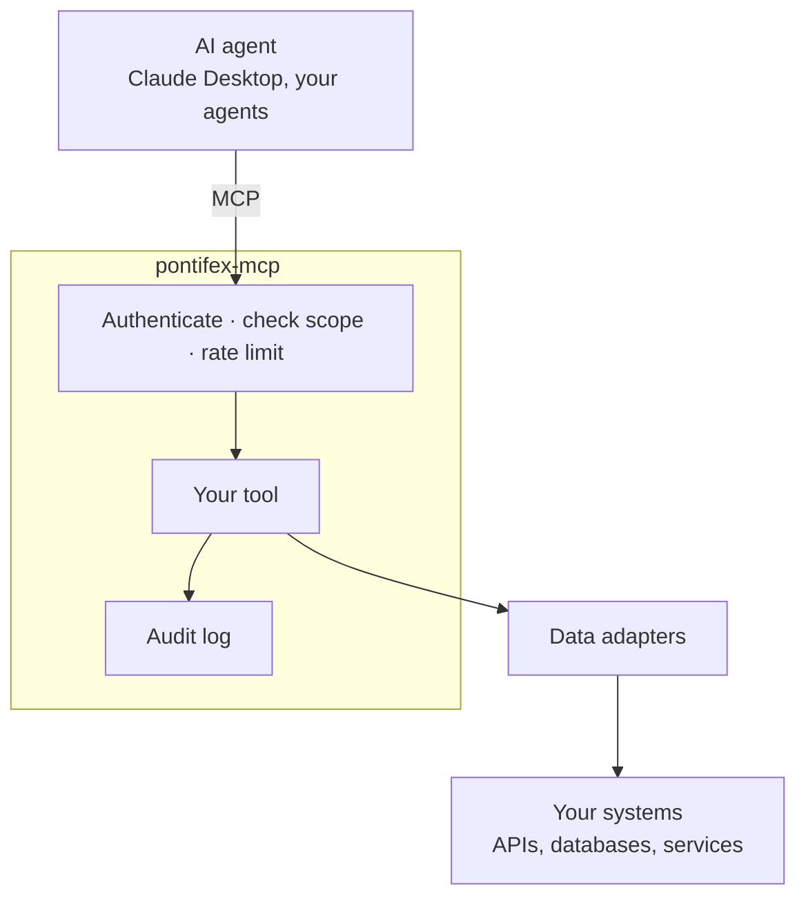

# Pontifex MCP

**Enterprise-grade MCP servers. Governed by default.**

Authentication, least-privilege scopes, and a full audit trail on every tool call —
built on the official [MCP Python SDK](https://github.com/modelcontextprotocol/python-sdk).

[Get started](learn/quickstart.md){ .md-button .md-button--primary }
[Why Pontifex](why.md){ .md-button }

## AI agents are ready to do real work

Your systems aren't ready to let them.

Connecting an agent to your orders API or your customer database means letting it call
production. Nobody signs off on that without answers. *Who's calling? What can they
touch? How often? And what happened?*

[MCP](https://modelcontextprotocol.io) — the open standard agents like Claude use to
call tools — gives you the connection. It doesn't give you the control.

So the pilot works in a demo. Then it waits for a security review it can't pass.

## Pontifex closes the gap

It turns your existing APIs, data stores, and internal services into tools any agent
can call. Every call is **authenticated, scoped to least privilege, rate-limited, and
audited.**

That's how an AI initiative gets out of pilot and into production — without handing
your data to a third party.

Built on the official MCP Python SDK. Open protocols throughout — OAuth 2.1, OpenAPI,
standard JWTs. Run it on the infrastructure you already have. Pair it with any AI
vendor. Strip it out whenever you like.

Your data never leaves your environment.

## What you get

-   :material-shield-check:{ .lg .middle } __Nothing runs unauthenticated__

    Every call carries a verified identity — an OAuth 2.1 JWT or an `sk_…` API key —
    checked before a handler runs. Any OIDC provider works.

-   :material-key-chain:{ .lg .middle } __Least privilege, enforced__

    Scopes are `domain:resource:action`, declared per tool. Callers can't widen their
    own access. Ever.

-   :material-clipboard-text-clock:{ .lg .middle } __"Who touched what" — answered__

    Every call recorded: caller, tool, parameters, data source, latency. The trail
    your auditors ask for.

-   :material-lightning-bolt:{ .lg .middle } __Resilient under load__

    Per-caller rate limiting, source failover, circuit breaking. A flaky upstream
    won't take you down with it.

-   :material-power-plug:{ .lg .middle } __No code for an existing API__

    Point a config file at an OpenAPI spec. Every allowlisted operation becomes a
    governed tool. [Connectors →](learn/connect-an-api.md)

-   :material-server-network:{ .lg .middle } __Yours to run__

    A Python library you self-host. No third party in the path. MIT licensed.

## Where to next

-   __Evaluating it?__

    The case for a governance layer, and when *not* to use one.

    [Why Pontifex →](why.md)

-   __Building with it?__

    An authenticated, audited server running in minutes.

    [Quickstart →](learn/quickstart.md)

-   __Reviewing the security?__

    The model behind "safe to point at production."

    [Security →](concepts/security.md)

---

MIT licensed. Part of [Argonauts](https://argonauts.chrisdare.me).
