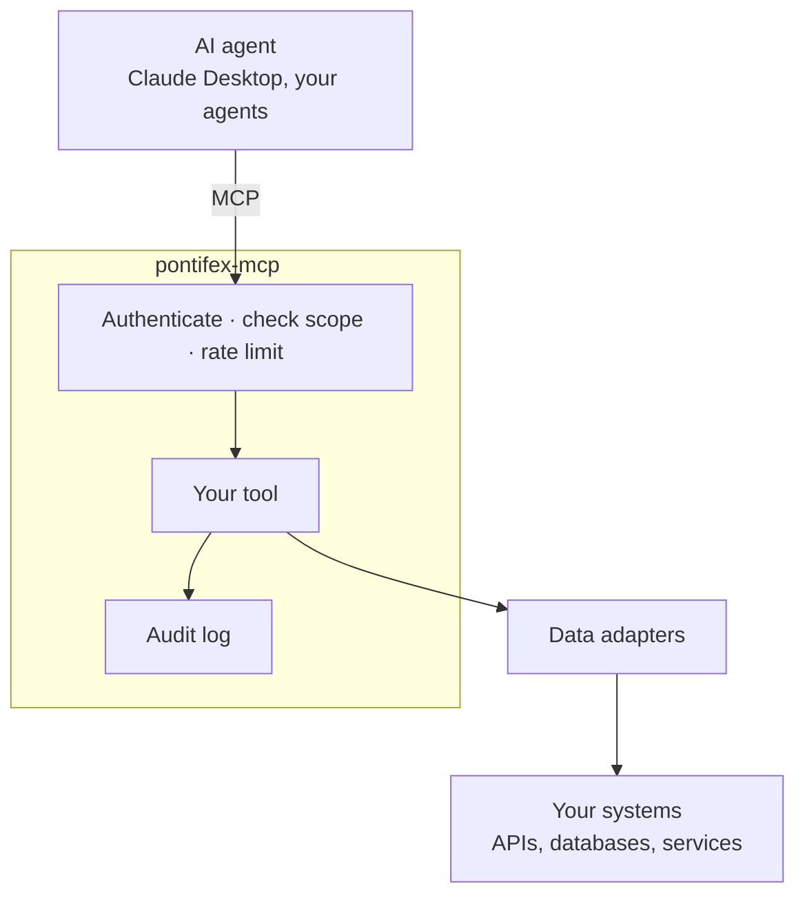

# Pontifex MCP

**Enterprise-grade MCP servers, governed by default.**

Pontifex adds authentication, least-privilege scopes, and a full audit trail to every
tool call. It builds on the official
[MCP Python SDK](https://github.com/modelcontextprotocol/python-sdk).

[Get started](learn/quickstart.md){ .md-button .md-button--primary }
[Why Pontifex](why.md){ .md-button }

## The problem

An AI agent can do real work once it reaches your systems. Connecting it to your orders
API or your customer database means letting it call production, and your security team
will not approve that until they can answer four questions. Who is calling? What can
they touch? How often? And what did they do?

[MCP](https://modelcontextprotocol.io), the open standard agents like Claude use to
call tools, standardizes the connection. It says nothing about that control. So the
pilot works in a demo, then stalls at a security review it cannot pass.

## What Pontifex does

Pontifex turns your existing APIs, data stores, and internal services into tools an
agent can call. It authenticates every call, checks the caller's scopes, enforces a
rate limit, and writes an audit record.

Your AI project ships to production, and your data stays in your environment.

Pontifex builds on the official MCP Python SDK and uses open protocols throughout:
OAuth 2.1, OpenAPI, and standard JWTs. You run it on the infrastructure you already
have, pair it with any AI vendor, and remove it whenever you want. Your tools stay
standard MCP underneath.

## What you get

-   :material-shield-check:{ .lg .middle } __Nothing runs unauthenticated__

    Every call carries a verified identity, an OAuth 2.1 JWT or an `sk_…` API key.
    Pontifex checks it against any OIDC provider before your handler runs.

-   :material-key-chain:{ .lg .middle } __Least privilege, enforced__

    Scopes are `domain:resource:action`, declared per tool. A caller cannot widen their
    own access at runtime.

-   :material-clipboard-text-clock:{ .lg .middle } __Audit you can hand to a reviewer__

    Pontifex records every call: the caller, the tool, the parameters, the data source,
    and the latency.

-   :material-lightning-bolt:{ .lg .middle } __Resilient under load__

    Per-caller rate limiting, source failover, and circuit breaking keep one slow
    upstream from stalling the server.

-   :material-power-plug:{ .lg .middle } __No code for an existing API__

    Point a config file at an OpenAPI spec, and Pontifex governs every allowlisted
    operation as a tool. [Connectors](learn/connect-an-api.md)

-   :material-server-network:{ .lg .middle } __Yours to run__

    A Python library you self-host. No third party sits in the request path. MIT
    licensed.

## Where to next

-   __Evaluating it?__

    The case for a governance layer, and when to skip one.

    [Why Pontifex](why.md)

-   __Building with it?__

    An authenticated, audited server running in minutes.

    [Quickstart](learn/quickstart.md)

-   __Reviewing the security?__

    The model behind "safe to point at production."

    [Security](concepts/security.md)

---

MIT licensed. Part of [Argonauts](https://argonauts.chrisdare.me).
