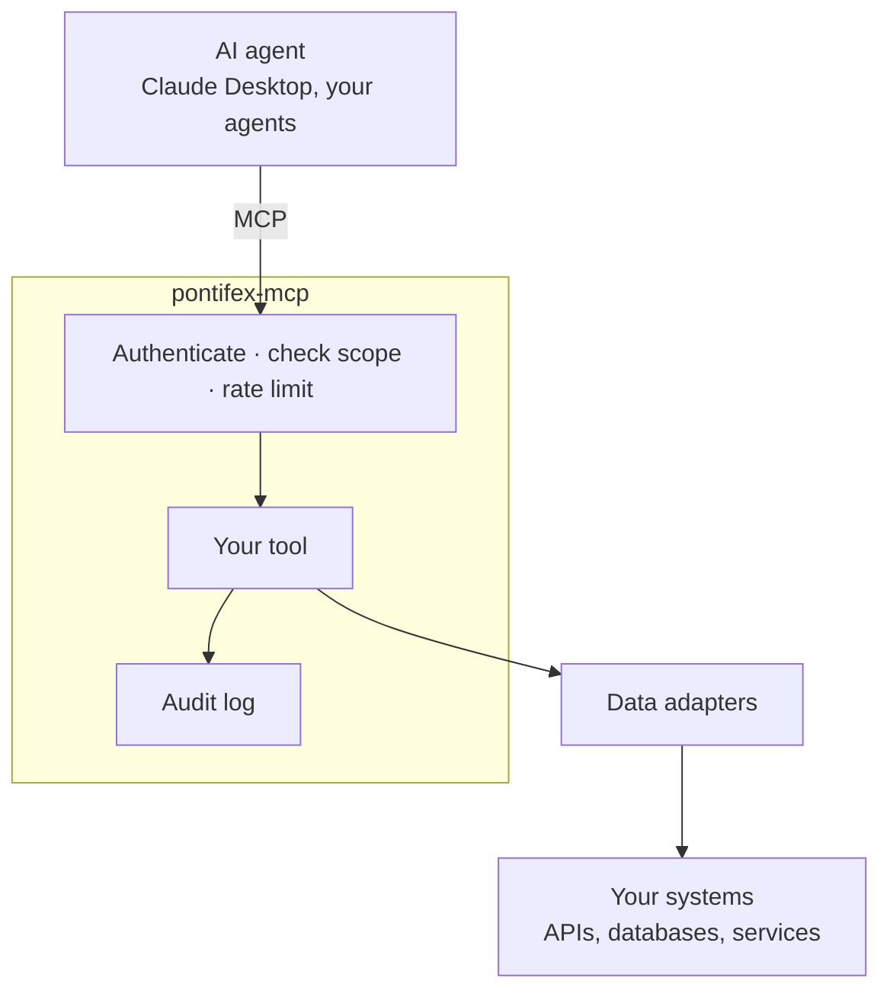

# Overview

**Enterprise-grade MCP servers, governed by default.**

Pontifex adds authentication, least-privilege scopes, and a full audit trail to every
tool call. It builds on the official
[MCP Python SDK](https://github.com/modelcontextprotocol/python-sdk).

[Quickstart](learn/quickstart.md){ .md-button .md-button--primary }

## Why Pontifex

Your APIs and internal systems were built for your applications and employees, not for
an autonomous agent. Point an agent at them and your security team asks four questions:

> Who is calling, what can they touch, how often, and what did they do?

[MCP](https://modelcontextprotocol.io), the protocol agents use to call tools,
standardizes the connection and leaves the control to you. So your team builds a strong
pilot, and it stalls at the first system that holds real data.

Pontifex answers those four questions, so you can ship the pilot.

## What Pontifex does

Pontifex wraps your existing APIs and services in governed MCP tools. It authenticates
every request and writes an audit record before any handler runs. You ship to
production; your data stays in your environment.

## What it changes

| Without a governance layer | With Pontifex |
| --- | --- |
| An agent's access is all-or-nothing | You scope each caller to the exact tools they need |
| "Trust the agent" | You trust a verified identity on every call |
| No record of what the agent did | A full audit row per call: caller, tool, data source, latency |
| One slow upstream stalls everything | Rate limiting, failover, and circuit breaking contain it |
| Your data flows through a vendor | You self-host; nothing leaves your environment |

## What you get

-   :material-shield-check:{ .lg .middle } __Nothing runs unauthenticated__

    Every call carries a verified identity: an OAuth 2.1 JWT or an `sk_…` API key.
    Pontifex checks it against any OIDC provider before your handler runs.

-   :material-key-chain:{ .lg .middle } __Least privilege, enforced__

    Scopes are `namespace:resource:action`, declared per tool. A caller cannot widen their
    own access at runtime.

-   :material-clipboard-text-clock:{ .lg .middle } __Audit you can hand to a reviewer__

    Pontifex records every call: the caller, the tool, the parameters, the data source,
    and the latency.

-   :material-lightning-bolt:{ .lg .middle } __Resilient under load__

    Per-caller rate limiting, source failover, and circuit breaking keep one slow
    upstream from stalling the server.

-   :material-power-plug:{ .lg .middle } __No code for an existing API__

    Point a config file at an OpenAPI spec, and Pontifex governs every allowlisted
    operation as a tool. [Connectors](learn/connect-an-api.md)

-   :material-server-network:{ .lg .middle } __Yours to run__

    A Python library you self-host. No third party sits in the request path. Apache-2.0
    licensed.

## Pontifex vs. the MCP SDK alone

The SDK gives you a server. Pontifex makes it safe to run on real systems.

| | MCP Python SDK | Pontifex MCP |
| --- | --- | --- |
| Define and serve tools | ✅ | ✅ (built on it) |
| Authenticate callers | — | ✅ API keys + OAuth 2.1 |
| Per-caller scopes | — | ✅ `namespace:resource:action` |
| Audit log | — | ✅ every call, to Postgres |
| Rate limiting | — | ✅ per caller |
| Resilience (failover, breakers) | — | ✅ |
| Onboard an OpenAPI API with no code | — | ✅ |

## Built on open standards

Pontifex does not ask you to bet on a platform. It builds on the official MCP Python
SDK and uses OAuth 2.1 and standard JWTs for identity, so you bring any OIDC provider:
Auth0, Entra, Clerk, or Keycloak. It reads OpenAPI to onboard existing systems and
speaks RFC 9728 and RFC 8693 for discovery and token exchange.

Pair it with any AI vendor and run it anywhere you run Python. Drop the dependency to
remove it; your tools stay standard MCP underneath.

## You hold the data

Pontifex is a library you run, not a service you send data to.

It sits inside your environment, between the agent and your systems. No third party
sits in the request path. You supply the database and credentials from your own
infrastructure. Pontifex hardcodes nothing and phones nothing home.

That is what lets your security and compliance teams sign off on "we are connecting AI
to customer data."

## When to skip it

If you are shipping a single public tool over non-sensitive data, use the MCP SDK on
its own. You do not need auth or an audit trail yet, and adding them buys you nothing.

Pontifex pays off once a real system and real identity are involved. At that point,
unauthenticated access is no longer acceptable.

## Where to next

-   __Building with it?__

    An authenticated, audited server running in minutes.

    [Quickstart](learn/quickstart.md)

-   __Reviewing the security?__

    The model behind "safe to point at production."

    [Security model](concepts/security.md)

-   __Onboarding an existing API?__

    Governed tools from an OpenAPI spec, no handler code.

    [Connect an API](learn/connect-an-api.md)

-   __Sizing the architecture?__

    How a request travels through auth, scopes, and audit.

    [How a request flows](concepts/request-path.md)

---

Apache-2.0 licensed.
